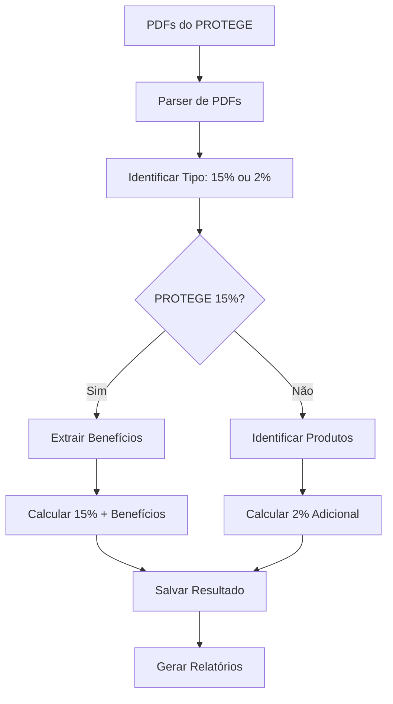

# PROTEGE - Programa de Recuperação e Otimização Tributária de Goiás

## 📋 Visão Geral

O PROTEGE é um programa estadual de Goiás que oferece dois regimes tributários distintos:

1. **PROTEGE 15%** - Regime normal com benefícios fiscais condicionados
2. **PROTEGE 2%** - Adicional sobre ICMS com sistema de crédito cruzado

## 🎯 Benefícios Fiscais (PROTEGE 15%)

### 1. **Base Reduzida de ICMS**
- **BR001**: Produtos da Cesta Básica (60% da base, alíquota 7%)
- **BR002**: Medicamentos Essenciais (50% da base, alíquota 7%)

### 2. **Crédito Outorgado**
- **CO001**: Investimentos em Máquinas e Equipamentos (25%)
- **CO002**: Projetos de Inovação Tecnológica (30%)

### 3. **DIFAL (Diferencial de Alíquotas)**
- **DIFAL001**: Operações Interestaduais (40% do ICMS)

### 4. **CIAP (Crédito de ICMS sobre Ativo Permanente)**
- **CIAP001**: Aquisição de Ativo Permanente (10% do ICMS)

## 🛍️ Produtos Aplicáveis (PROTEGE 2%)

### Produtos Específicos:
- Produtos de beleza e cosméticos
- **Tocador de beleza**
- Produtos de higiene pessoal
- Perfumes e fragrâncias
- Produtos de maquiagem
- Acessórios de beleza
- Produtos para cabelo
- Produtos para pele

## 🚀 Funcionalidades

### 1. **Upload de PDFs do PROTEGE**
```bash
POST /api/protege/upload-pdfs
Content-Type: multipart/form-data

{
  "empresaId": "empresa-123",
  "pdfs": [arquivo1.pdf, arquivo2.pdf, ...]
}
```

**PDFs Suportados:**
- `protege goias.pdf` - Regras do PROTEGE 15%
- `protege goias 2%.pdf` - Regras do PROTEGE 2%
- `guia_pratico_5.7.pdf` - Guia prático de benefícios
- `manual de auditoria sefaz goias.pdf` - Manual de auditoria

### 2. **Cálculo do PROTEGE**
```bash
POST /api/protege/calcular
Content-Type: application/json

{
  "empresaId": "empresa-123",
  "periodo": "202501"
}
```

**Resposta:**
```json
{
  "success": true,
  "resultado": {
    "id": "protege_empresa-123_202501_1234567890",
    "empresaId": "empresa-123",
    "periodo": "202501",
    "totalBaseCalculo": 1000000.00,
    "totalProtege15": 150000.00,
    "totalProtege2": 20000.00,
    "totalBeneficios": 120000.00,
    "valorFinal": 50000.00,
    "dataCalculo": "2025-01-15T10:30:00.000Z"
  }
}
```

### 3. **Consulta de Resultado**
```bash
GET /api/protege/resultado/{empresaId}/{periodo}
```

### 4. **Listagem de Resultados**
```bash
GET /api/protege/resultados/{empresaId}
```

### 5. **Relatório Consolidado**
```bash
GET /api/protege/relatorio/{empresaId}?periodoInicio=202501&periodoFim=202512
```

### 6. **Detalhes do Cálculo**
```bash
GET /api/protege/detalhes/{empresaId}/{periodo}
```

### 7. **Atualização de Configuração**
```bash
PUT /api/protege/configuracao/{empresaId}
Content-Type: application/json

{
  "ativo": true,
  "regras": [...],
  "beneficios": [...]
}
```

## 🔧 Arquitetura

### 1. **Parser de PDFs** (`protege-pdf-parser.ts`)
- Extração de texto de PDFs
- Parsing de regras e benefícios
- Identificação automática de tipos de documento
- Diferenciação entre PROTEGE 15% e 2%

### 2. **Motor de Cálculo** (`protege-calculator.ts`)
- **PROTEGE 15%**: Aplicação da alíquota de 15% + benefícios
- **PROTEGE 2%**: Adicional sobre ICMS normal
- Validação de elegibilidade
- Verificação de produtos aplicáveis
- Geração de relatórios

### 3. **Serviço Principal** (`protege-service.ts`)
- Orquestração do processamento
- Integração com cache
- Busca de dados SPED Fiscal
- Geração de relatórios consolidados

### 4. **API REST** (`protege.ts`)
- Endpoints completos
- Upload de arquivos
- Validação de dados
- Tratamento de erros

### 5. **Integração com Watcher** (`multi-empresa-watcher.ts`)
- Detecção automática de PDFs
- Processamento em background
- Cálculo automático por período

## 📊 Fluxo de Processamento



## 🧪 Testes

### Executar Testes Completos
```bash
cd sistema-tributario/backend
node scripts/test-protege.js
```

### Testes Incluídos:
1. **Upload de PDFs** - Testa processamento de documentos
2. **Cálculo do PROTEGE** - Testa motor de cálculo (15% e 2%)
3. **Consulta de Resultado** - Testa busca de dados
4. **Listagem de Resultados** - Testa listagem por empresa
5. **Relatório Consolidado** - Testa relatórios
6. **Detalhes do Cálculo** - Testa detalhamento

## 📈 Exemplos de Cálculo

### **Exemplo 1: PROTEGE 15%**
- **Base de Cálculo**: R$ 1.000.000,00
- **Alíquota PROTEGE**: 15%
- **Valor PROTEGE**: R$ 150.000,00
- **Benefícios Aplicados**: R$ 120.000,00
- **Resultado Final**: R$ 30.000,00

### **Exemplo 2: PROTEGE 2%**
- **Produto**: Tocador de beleza
- **Base de Cálculo**: R$ 100.000,00
- **ICMS Normal**: R$ 19.000,00 (19%)
- **PROTEGE 2%**: R$ 2.000,00 (2% adicional)
- **ICMS Total**: R$ 21.000,00 (21%)

### **Exemplo 3: Misto**
- **PROTEGE 15%**: R$ 30.000,00
- **PROTEGE 2%**: R$ 5.000,00
- **Total**: R$ 35.000,00

## 🔒 Condições de Elegibilidade

### **PROTEGE 15%:**
1. **Empresa estabelecida em Goiás**
2. **Adesão ao programa PROTEGE 15%**
3. **Utilização de benefícios fiscais**
4. **Pagamento em dia das obrigações**

### **PROTEGE 2%:**
1. **Empresa estabelecida em Goiás**
2. **Produtos enquadrados na legislação**
3. **ICMS normal aplicado**
4. **Documentação em conformidade**

## 📋 Relatórios Disponíveis

### 1. **Relatório Consolidado**
- Total por período
- Separação PROTEGE 15% vs 2%
- Benefícios por tipo
- Evolução temporal

### 2. **Relatório Detalhado**
- Item por item
- Tipo de PROTEGE aplicado
- Benefícios aplicados (15%)
- Produtos específicos (2%)

### 3. **Relatório de Benefícios**
- Agrupamento por tipo
- Valores por benefício
- Condições de aplicação
- Impacto financeiro

## 🚀 Próximos Passos

### Fase 1: Implementação Atual ✅
- [x] Parser de PDFs (15% e 2%)
- [x] Motor de cálculo diferenciado
- [x] API REST
- [x] Integração com watcher
- [x] Testes automatizados

### Fase 2: Melhorias Planejadas
- [ ] Persistência em banco de dados
- [ ] Versionamento de regras
- [ ] Dashboard web
- [ ] Notificações automáticas
- [ ] Integração com SEFAZ

### Fase 3: Funcionalidades Avançadas
- [ ] IA para extração de PDFs
- [ ] Validação automática de produtos
- [ ] Integração com outros sistemas
- [ ] Relatórios avançados
- [ ] Auditoria automática

## 📞 Suporte

Para dúvidas ou problemas com o módulo PROTEGE:

1. **Documentação**: Consulte este arquivo
2. **Testes**: Execute `node scripts/test-protege.js`
3. **Logs**: Verifique logs em `logs/application-*.log`
4. **Issues**: Abra issue no repositório

---

**Desenvolvido para o Sistema Tributário - Fase 3: Agente de Cálculo ICMS** 

## PROTEGE 2% - Sistema de Crédito Cruzado

### Mecânica do Crédito Cruzado

O PROTEGE 2% funciona como um **sistema de empréstimo** para o governo:

#### Mês 1 (Pagamento)
- Empresa paga 2% adicional sobre ICMS
- Exemplo: ICMS 19% + 2% = 21% total
- Valor adicional é "emprestado" ao governo

#### Mês 2 (Crédito)
- Empresa recebe crédito de 2% sobre base de cálculo
- Compensa o pagamento do mês anterior
- "Empréstimo" é devolvido

### Fluxo Contínuo
```
Janeiro: Paga 2% adicional → Fevereiro: Recebe crédito de 2%
Fevereiro: Paga 2% adicional → Março: Recebe crédito de 2%
Março: Paga 2% adicional → Abril: Recebe crédito de 2%
```

### Produtos Aplicáveis
- Perfumes e fragrâncias
- Cosméticos e maquiagem
- Produtos de beleza
- Outros produtos específicos

## Implementação Técnica

### Estrutura de Dados

```typescript
interface ProtegeRegra {
  tipoProtege: 'PROTEGE_15' | 'PROTEGE_2';
  aliquotaProtege: number;
  produtosAplicaveis?: string[];
  beneficios?: ProtegeBeneficio[];
  // ... outros campos
}

interface ProtegeApuracaoResultado {
  // ... campos básicos
  protege2Pagamento: number; // Valor pago no mês atual
  protege2Credito: number;   // Crédito recebido do mês anterior
  saldoProtege2: number;     // Saldo final (pagamento - crédito)
}
```

### Cálculo do Crédito Cruzado

```typescript
// Buscar crédito do mês anterior
const creditoMesAnterior = await buscarCreditoMesAnterior(empresaId, periodo);

// Calcular PROTEGE com crédito
const resultado = ProtegeCalculator.calcularProtege(
  itens,
  regras,
  empresaId,
  periodo,
  creditoMesAnterior
);

// Salvar pagamento para crédito no próximo mês
if (resultado.protege2Pagamento > 0) {
  await salvarPagamentoProtege2(empresaId, periodo, resultado.protege2Pagamento);
}
```

## Endpoints da API

### Processamento de PDFs
```http
POST /protege/processar-pdfs
Content-Type: multipart/form-data

empresaId: string
arquivos: File[]
```

### Cálculo do PROTEGE
```http
POST /protege/calcular
Content-Type: application/json

{
  "empresaId": "string",
  "periodo": "YYYYMM"
}
```

### Consulta de Crédito do Mês Anterior
```http
GET /protege/credito-mes-anterior/{empresaId}/{periodo}
```

### Histórico de Pagamentos
```http
GET /protege/historico-pagamentos/{empresaId}?periodoInicio=YYYYMM&periodoFim=YYYYMM
```

### Relatório de Crédito Cruzado
```http
GET /protege/relatorio-credito-cruzado/{empresaId}?periodoInicio=YYYYMM&periodoFim=YYYYMM
```

## Exemplo de Uso

### 1. Processar PDFs do PROTEGE
```javascript
const formData = new FormData();
formData.append('empresaId', 'EMPRESA_001');
formData.append('arquivos', pdfFile1);
formData.append('arquivos', pdfFile2);

const response = await fetch('/protege/processar-pdfs', {
  method: 'POST',
  body: formData
});
```

### 2. Calcular PROTEGE para um período
```javascript
const response = await fetch('/protege/calcular', {
  method: 'POST',
  headers: { 'Content-Type': 'application/json' },
  body: JSON.stringify({
    empresaId: 'EMPRESA_001',
    periodo: '202501'
  })
});

const resultado = await response.json();
console.log('Valor final:', resultado.resultado.valorFinal);
console.log('PROTEGE 2% pago:', resultado.resultado.protege2Pagamento);
console.log('PROTEGE 2% crédito:', resultado.resultado.protege2Credito);
console.log('Saldo PROTEGE 2%:', resultado.resultado.saldoProtege2);
```

### 3. Consultar crédito do mês anterior
```javascript
const response = await fetch('/protege/credito-mes-anterior/EMPRESA_001/202502');
const credito = await response.json();
console.log('Crédito disponível:', credito.creditoMesAnterior);
```

## Relatórios Disponíveis

### Relatório Consolidado
- Total por período
- Breakdown por tipo de PROTEGE
- Benefícios aplicados
- Saldos de crédito cruzado

### Relatório de Crédito Cruzado
- Pagamentos por mês
- Créditos recebidos
- Saldos acumulados
- Fluxo de compensação

### Histórico de Pagamentos
- Pagamentos PROTEGE 2% por período
- Mês de crédito correspondente
- Total de pagamentos

## Integração com Multi-Empresa

O sistema PROTEGE está integrado ao watcher multi-empresa:

1. **Detecção Automática**: PDFs do PROTEGE são detectados automaticamente
2. **Processamento**: Regras são extraídas e configuradas
3. **Cálculo**: PROTEGE é calculado quando dados SPED estão disponíveis
4. **Controle de Crédito**: Sistema gerencia automaticamente o crédito cruzado

## Testes

Execute o script de teste para verificar a funcionalidade:

```bash
cd scripts
node test-protege-credito-cruzado.js
```

O script demonstra:
- Cálculo de 3 meses consecutivos
- Aplicação do crédito cruzado
- Geração de relatórios
- Detalhamento dos benefícios

## Considerações Importantes

### Elegibilidade
- Empresa deve estar estabelecida em Goiás
- Em dia com obrigações fiscais
- Adesão ao programa PROTEGE

### Produtos PROTEGE 2%
- Lista específica de produtos aplicáveis
- Verificação por NCM, CFOP e descrição
- Controle rigoroso de elegibilidade

### Benefícios PROTEGE 15%
- Condicionados ao pagamento do PROTEGE
- Verificação de condições específicas
- Cálculo dinâmico baseado em regras

### Crédito Cruzado
- Controle automático de pagamentos e créditos
- Persistência em cache por 30 dias
- Relatórios detalhados de fluxo

## Próximos Passos

1. **Persistência no Banco**: Migrar dados do cache para banco de dados
2. **Validações Avançadas**: Implementar validações mais robustas
3. **Dashboard**: Interface visual para controle
4. **Automação**: Integração completa com pipeline de processamento
5. **Auditoria**: Sistema de logs e auditoria de cálculos 